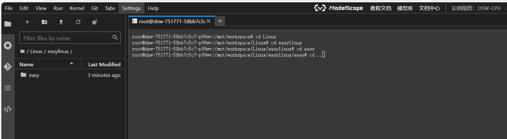

# Lesson2.Linux 基础命令与文档管理

## 前言

在这一节当中我们将会学习到Linux的基础命令与初步的文档管理。

## 1.系统时间操作

### 1.1.查看与设置系统时间
1. 查看当前时间
  - 命令：`date`
  - 作用：简单地显示当前系统的时间，包括年、月、日、时、分、秒等信息。

   

2. 以特定格式显示时间
  - 命令：`date +%Y/%m/%d`(这里的字母对应为Y：year，m：month，d：day)
  - 作用：按照指定的格式“年/月/日”来显示当前时间。这在需要特定时间格式输出的场景中非常有用，比如在编写脚本生成日志文件时，将时间以特定格式作为文件名的一部分，便于后续的管理和查询。


3. 查看昨天的日期
  - 命令：`date -d yesterday`（或`date --date=yesterday`）
  - 作用：快速获取昨天的日期信息。在处理一些与时间序列相关的数据备份、日志分析等任务时，可能需要知道前一天的日期，此命令可以方便地提供该信息。


## 2.命令行操作辅助技巧

### 2.1.命令补全
- 命令：`[tab]`
- 作用：这是一个非常便捷的命令行操作辅助键。当在终端输入命令、文件名或变量名的一部分后，按下`[tab]`键，系统会自动尝试补全剩余部分。如果输入的部分能够唯一确定一个命令、文件或变量，系统会直接补全；如果存在多个匹配项，再次按下`[tab]`键，系统会列出所有可能的匹配项，方便用户选择。例如，输入“ls /et”后按`[tab]`键，系统会补全为“ls /etc”，因为在根目录下“etc”是唯一以“et”开头的目录。

按`[Tab]`前
  


按`[Tab]`后


### 2.2.中断命令
- 命令：`[ctrl]+c`
- 作用：在执行一个长时间运行或者不需要继续执行的命令时，可以按下`[ctrl]+c`组合键来中断该命令的执行。
下面给出死循环的指令代码：
```
#!/bin/bash
while true; do
    echo "这是一个死循环"
done
```


按下`[ctrl]+c`后的效果，可以看到死循环直接被停止。一般按一下就可以了，因为操作系统有时候会卡顿一下，并不是没有反应。


## 3. 文件与目录操作

### 3.1. 切换工作目录

**先在原环境下建一个名为“Linux”的文件夹**

- 命令：`cd`

- 作用：`cd`命令用于在 Linux 文件系统中切换当前工作目录。例如，输入“`cd Linux`”可以将当前工作目录切换到“`Linux`”目录下。在云端命令行操作中，很多命令的执行结果会与当前工作目录相关，如文件的创建、查找、复制等操作，因此熟练掌握`cd`命令可以方便地在不同目录之间进行切换，提高操作效率。


### 3.2. 显示当前工作目录路径
- 命令：`pwd`
- 作用：`pwd`是“print working directory”的缩写，用于显示当前工作目录的绝对路径。图中可以看到当前工作目录的路径。


### 3.3. 创建目录
- 命令：`mkdir`
- 作用：用于创建新的目录。例如，输入“`mkdir easylinux`”会在当前工作目录下创建一个名为“`easylinux`”的新目录。

- 创建完成后可以在左边文件列表中双击“Linux”文件进入，然后就可以看到如下图所示的新建目录（文件夹）了。 


- 也可以指定完整的路径来创建目录，如“`mkdir /mnt/workspace/Linux/easy`”会在“`/mnt/workspace/Linux/`”目录下创建名为“`easy`”目录。


**这里我们还需要创建一个`.txt`文档来方便我们的后续操作。**

- 命令：`touch linuxname.txt`

  

创建完成后找到文件，双击进入，可以在里面写上需要的内容。

### 3.4. 复制文件与目录
1. 复制文件
  - 命令：`cp`
  - 作用：`cp`命令用于复制文件或目录。例如，“`cp linux.txt /mnt/workspace/Linux/easy/`”会将当前目录下的“`linux.txt`”文件复制到“`/mnt/workspace/Linux/easy/`”目录下。


- 查看复制后的结果


2. 递归复制目录
  - 命令：`cp -r`
  - 作用：当复制目录时，由于目录可能包含子目录和文件，需要使用`cp -r`命令进行递归复制。例如，“`cp -r easy /mnt/workspace/Linux/easylinux/`”会将“`easy`”目录及其所有子目录和文件完整地复制到“`/mnt/workspace/Linux/easylinux`”目录下。
  可以看到easy已经被复制到easylinux文件当中


- 这时候我们再点进去检查一下`linux.txt`文件有没有在里面。


**可以看到，linux.txt文件也一并复制过去了。**

### 3.5. 删除文件与目录
1. 删除文件
  - 命令：`rm`
  - 作用：`rm`命令用于删除文件或目录。
  例如，“`rm linux.txt`”会删除当前目录下的“`linux.txt`”文件。但需要注意，使用`rm`命令删除的文件通常无法恢复，所以在执行删除操作时要谨慎确认。在云端环境中，如果误删除重要数据可能会影响服务运行，务必小心。

删除刚刚复制过去的`linux.txt`文件


**可以看到，此时linux.txt文件被删除了。**

**删除过后需要返回上一级目录，可以使用命令：`cd ..`来返回上一级目录，注意，`cd`后有空格。**




2. 递归删除目录
  - 命令：`rm -r`
  - 作用：与`cp -r`类似，当删除目录时，若目录包含子目录和文件，需要使用`rm -r`命令进行递归删除。
  例如，“`rm -r easy`”会删除“`esy`”目录及其所有子目录和文件。


**图中可以看到easy文件夹已经被完全删除。**

3. 删除时提示确认
  - 命令：`rm -i`
  - 作用：为了避免误删除重要文件或目录，使用`rm -i`命令在删除每个文件或目录之前会提示用户进行确认。
  例如，“`rm -i linux.txt`”在执行删除操作时，会先询问用户是否确认删除“`linux.txt`”，用户输入“`y`”表示确认删除，输入其他字符则取消删除操作。这在云端操作中能有效防止误操作导致的数据丢失。


### 3.6. 文件查找
1. 在目录中查找文件（记得返回查找文件的上级目录哦~！）
  - 命令：`find Linux`
  - 作用：`find`命令用于在指定目录及其子目录中查找文件。例如，“`find Linux`”会在“`Linux`”目录及其所有子目录下查找文件，并列出找到的文件路径。这在不知道文件具体位置但知道大致所在目录时非常有用，可以快速定位到需要的文件。在云端服务器配置文件众多的情况下，`find`命令能帮助快速定位特定文件。


**可以看到左边的有Linux的文档名与文档下面的所有文件**

2. 在目录查找中筛选关键字
  - 命令：`find Linux -name '*easy*'` 
  - 作用：在“`Linux`”目录查找中，使用“`find Linux -name '*easy*'`”可以找出所有文件名中包含“`easy`”关键字的文件，有助于更精准地定位到与特定主题相关的文件，如与用户组相关的配置文件等。


### 3.7.查看文件内容
1. 查看文件全部内容
    - 指令：`cat`
    - 作用：将文件内容全部输出到终端。例如，`cat linux.txt`会显示`linux.txt`的全部内容。


2. 查看文件前几行
    - 指令：`head`
    - 作用：默认显示文件的前10行内容。例如，`head linux.txt`会显示`linux.txt`的前10行。


3. 查看文件后几行
    - 指令：`tail`
    - 作用：默认显示文件的后10行内容。例如，`tail linux.txt`会显示`linux.txt`的后10行。


### 3.8.通配符的使用

## 通配符简介

- 通配符是一种特殊的字符，在Linux系统中用于代表一个或多个其他字符。它们主要用于文件名、路径或文本搜索等操作中，帮助用户更灵活地指定文件或内容的范围进行操作。

**这里我们将会先建几个`.txt`不同名字的文件**

命令如下：
```
touch a.txt
touch b.txt
touch e.txt
touch 2.txt
touch 4.txt
touch 9.txt
touch li2.txt
```

1. `*`：代表0个到无穷多个任意字符。例如，`ls *.txt`会列出所有以`.txt`结尾的文件。


2. `?`:代表一定有一个任意字符。例如，`ls li?.txt`会列出文件名以`li`开头，后面紧跟一个任意字符，再以`.txt`结尾的文件。
- 说明：这里只显示`li2.txt`,而不是`linux.txt`，说明`?`在结尾处最后一个。


3. `[]`：代表一定有一个在括号内的字符（非任意字符）。例如，`ls [abc].txt`会列出文件名以`a`、`b`或`c`开头，再以`.txt`结尾的文件。


4. `[-]`：若有减号在中括号内时，代表在编码顺序内的所有字符。例如，`ls [0-9].txt`会列出文件名以数字0到9开头，再以`.txt`结尾的文件。


5. `[^ ]`：若中括号内的第一个字符为指数符号（^），那表示反向选择。例如，`ls [^abc].txt`会列出文件名不以`a`、`b`、`c`开头，再以`.txt`结尾的文件。
- 注意：有数字开头的也算哦~！


### 3.10.特殊文件名处理

### 3.10.1.处理含空白字符的文件名
1. 创建含空白字符的文件名
    - 指令：`mkdir "文件名"`
    - 作用：创建一个包含空白字符的文件名。例如，`mkdir "easy learn linux"`会创建一个名为`easy learn linux`的目录。


2. 删除含空白字符的文件名
    - 指令：`rmdir "文件名"`或`rmdir 文件名\ `
    - 作用：删除包含空白字符的文件名。例如，`rmdir "easy learn linux"`会删除名为`easy learn linux`的目录。


### 3.10.2.处理以加号或减号开头的文件名
1. 创建以加号或减号开头的文件名
    - 指令：`mkdir /路径/+文件名`或`mkdir /路径/-文件名`
    - 作用：创建以加号或减号开头的文件名。例如，`mkdir /mnt/workspace/+(-)linux`会在相应目录下创建以`+`或`-`开头的文件。

- 加（减）号开头文件名

  

2. 删除以加号或减号开头的文件名
    - 指令：`rm /路径/+文件名`或`rm /路径/-文件名`
    - 作用：删除以加号或减号开头的文件名。例如，`rmdir /mnt/workspace/+(-)linux`。


### 3.9. 查看磁盘使用情况
  - 命令：`df -h`
  - 作用：查看云端服务器磁盘的使用情况，包括各个文件系统的总容量、已使用空间、可用空间以及使用百分比等信息。例如，在管理云端存储资源时，通过`df -h`可以快速了解磁盘空间是否充足，以便及时调整存储策略或清理不必要的数据。


### 3.10. 查看内存使用情况
  - 命令：`free -h`
  - 作用：显示云端服务器的内存使用状况，包括总内存、已使用内存、空闲内存、共享内存以及缓冲和缓存内存等信息。这有助于监控服务器的内存资源，判断是否需要优化内存使用或增加内存配置，以确保云端服务的稳定运行。例如，当发现内存使用率过高时，可以进一步分析是哪些进程占用了大量内存，从而采取相应的措施。


### 3.11. 查看系统负载
  - 命令：`uptime`
  - 作用：查看云端服务器的系统负载情况，它会显示当前时间、系统已经运行的时间、当前登录用户数以及过去 1 分钟、5 分钟和 15 分钟的平均负载。平均负载反映了系统的繁忙程度，如果平均负载过高，可能表示服务器资源紧张，需要排查是 CPU、内存还是其他资源的瓶颈问题，以便及时调整资源分配或优化服务配置。


### 3.12. 查看进程信息
  - 命令：`ps -ef`
  - 作用：列出云端服务器上所有的进程信息，包括进程的用户、进程 ID（PID）、父进程 ID（PPID）、启动时间、终端设备、CPU 时间以及执行的命令等。在管理云端服务时，可以通过`ps -ef`查看正在运行的进程，了解服务的运行状态，并且在需要时可以根据进程信息进行进程的管理，如终止异常进程等。


### 3.13. 查看日志文件（以系统日志为例）
  - 命令：`journalctl -xe`
  - 作用：查看云端服务器的系统日志，以查看系统运行过程中的各种事件信息，包括系统启动信息、服务运行状态、错误信息等。`journalctl -xe`命令会以详细的格式显示最近的日志信息，并尝试解释日志中的错误和警告信息，有助于排查系统故障和了解系统运行状况。在云端环境中，通过查看日志文件可以及时发现并解决潜在的问题，保障服务的稳定性和可靠性。


  
