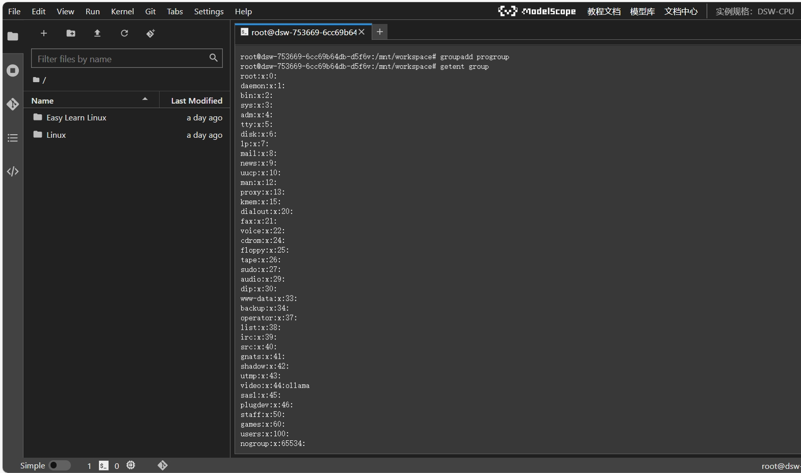

# Lesson3.Linux 文件权限与账号权限了解

## 前言

在本节当中我们将会学习文件的权限以及账号权限的相关操作，在结尾还会有对应的补充内容。

## 1.文件权限管理

### 1.1查看文件权限
在Linux中,使用`ls -l`或`ll`命令可以查看文件或目录的权限信息。

- 命令：`ls -l`
- 输出结果中的字段含义如下：

1. **第1个字符**：表示文件类型
   - `-`：普通文件
   - `d`：目录
   - `l`：链接文件等

2. **接下来的9个字符**：每3个一组,分别表示使用者、群组和其他人的权限
   - `r`：可读
   - `w`：可写
   - `x`：可执行

3. **后面的字段**：依次表示文件的链接数、所有者、所属群组、文件大小、最后修改时间和文件名。


**“drwxr - xr - x 3 root root 4096 11月 28 11:27 'Easy Learn Linux'”各字段含义如下**

1. **文件类型和权限**
   - **`d`**：表示这是一个目录(directory)。如果是`-`则表示普通文件,`l`表示链接文件等。
   - **`rwxr - xr - x`**：这是权限部分,每3个字符一组。
     - 第一组`rwx`表示文件所有者(user)的权限,`r`代表可读(read),`w`代表可写(write),`x`代表可执行(execute)。
     - 第二组`r - x`表示文件所属群组(group)的权限,这里`-`表示没有写的权限,只有读和执行权限。
     - 第三组`r - x`表示其他用户(others)的权限,同样只有读和执行权限。

2. **链接数**
   - **`3`**：表示该目录的硬链接数量。硬链接是指向同一个文件(或目录)的多个文件名。

3. **所有者和所属群组**
   - **`root root`**：第一个`root`表示文件的所有者是`root`用户,第二个`root`表示文件所属的群组是`root`群组。

4. **文件大小**
   - **`4096`**：表示该目录占用的磁盘空间大小,单位是字节。对于目录来说,这个大小通常是一个固定值(如4096字节),因为它主要存储目录中的文件和子目录的信息。

5. **最后修改时间**
   - **`11月 28 11:27`**：表示该目录最后一次被修改的时间。

6. **文件名**
   - **`'Easy Learn Linux'`**：这是该目录的名称。

### 1.2.修改文件权限

1. **使用chmod搭配数字法**

   - 权限对应数字：`r`对应4,`w`对应2,`x`对应1。

   - 例如,要将文件权限设置为`rwxr-----`(即所有者可读可写可执行,群组和其他人只读)：
   
   - 命令：`chmod 740 Linux`
   
   - 这里`7`是所有者权限(`rwx`,4 + 2 + 1 = 7),`4`是群组权限(`r--`,4),`0`是其他人权限(`---`,0)。


## 2.基础帐号管理

### 2.1.创建用户
使用`useradd`命令创建新用户。

例如,创建名为`datawhale`的用户：

- 命令：`useradd datawhale`

- 再通过`id datawhale`进行查看


### 2.2.设置用户密码
使用`passwd`命令为用户设置密码。

例如,为`datawhale`用户设置密码：
- 命令：`passwd datawhale`


**注意**

passwd + 用户名后会有图中的输入密码，但是输入的时候没有显示密码，这个不是bug，而是为了安全起见而不显示，输入正确后，第二个重新输入密码也是不显示的，只有两次输入一模一样，才会显示密码设置成功，请注意输入并且记住密码！！！

设置成功之后可以选择使用指令`login`，然后填写账号名与密码进入账户，退出时输入`exit`，即可退出当前账户。


### 2.3.删除用户
使用`userdel`命令删除用户。
例如,删除`datawhale`用户：
- 如果要删除用户名，使用命令`userdel datawhale`。但是会保留`datawhale`下的主目录。


**补充（学习者可自行尝试）**
- 如果要同时删除用户的主目录,使用`-r`选项：

- 命令`userdel -r datawhale`

### 2.4.创建群组
使用`groupadd`命令创建新群组。
例如,创建名为`progroup`的群组：
- 命令：`groupadd progroup`



 **创建完成后可以使用指令`getent group`查看**
 
  

### 2.5.创建用户并指定群组
- 使用`useradd -G`命令创建用户并指定其所属群组。
例如,创建`prouser1`、`prouser2`、`prouser3`用户并使其加入`progroup`群组：
- 命令：
```
useradd -G progroup prouser1
useradd -G progroup prouser2
useradd -G progroup prouser3
```

**创建完成之后可以使用`getent group progroup`（getent group + 群组名称）进行查看群组内的用户**


### 2.6.修改用户的群组
使用`usermod -G`命令修改用户的群组。
例如,将`prouser1`用户加入`student`群组：
- 命令：`usermod -G student prouser1`


**PS：删除群组：可以使用指令`groupdel + 用户名`，但是只有删除群组名字，并没有删除群组名下的用户，用户还需要用前面的手动删除**


## 3.帐号与权限用途

**下面内容是为了知识完整度而进行的补充**

### 3.1.用户自己复制指令并设置权限
用户可以将指令复制到自己的家目录并进行权限设置,以便自己执行。
例如,将`/bin/ls`复制为`myls`并设置权限：

1. 复制指令：

- 命令：`cp /bin/ls myls`

2. 设置权限：

- 命令：`chmod 700 myls`

### 3.2.共享目录设置
可以创建一个目录并设置其权限,使群组内的成员能够共享该目录。
例如,为`prouser1`、`prouser2`、`prouser3`用户创建共享目录`/srv/project1`：
1. 创建目录：

- 命令：`mkdir /srv/project1`

2. 设置群组：

- 命令：`chgrp progroup /srv/project1`

3. 设置权限：

- 命令：`chmod 770 /srv/project1`

### 3.3.共享执行档设置
可以设置执行档的权限,使群组内的成员能够执行,而其他人不能执行。
例如,将`/sbin/ifconfig`复制为`/usr/local/sbin/myif`,并设置只有`thegroup`群组的成员可以执行：
1. 复制文件：

- 命令：`cp /sbin/ifconfig /usr/local/sbin/myif`

2. 设置群组：

- 命令：`chgrp thegroup /usr/local/sbin/myif`

3. 设置权限：

- 命令：`chmod 750 /usr/local/sbin/myif`
