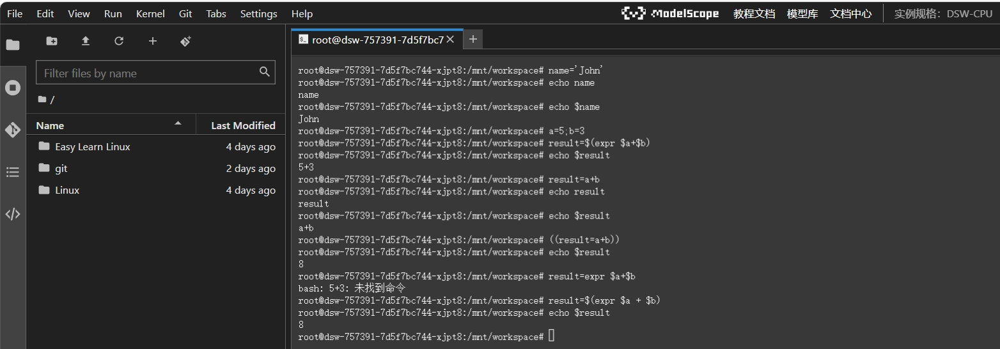
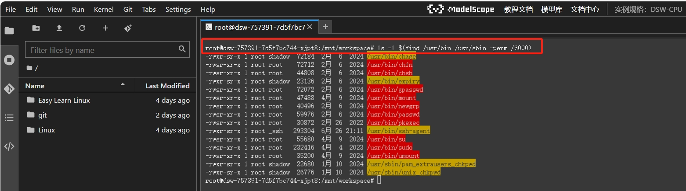
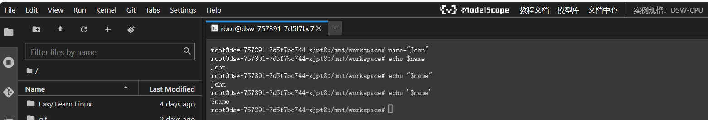
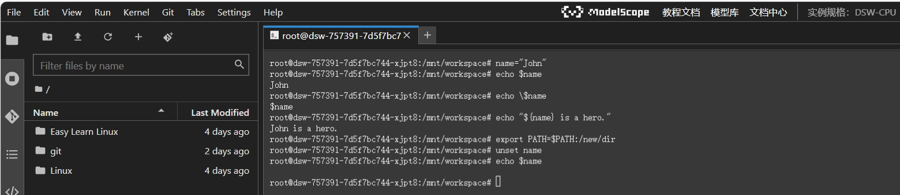
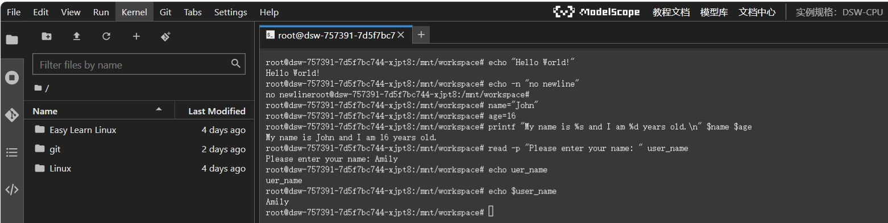
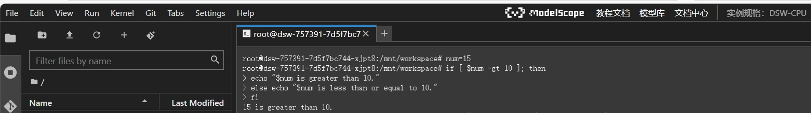
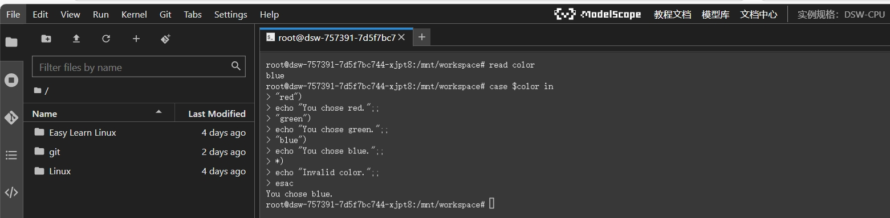
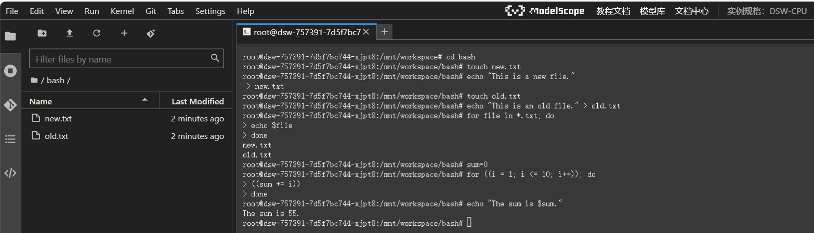
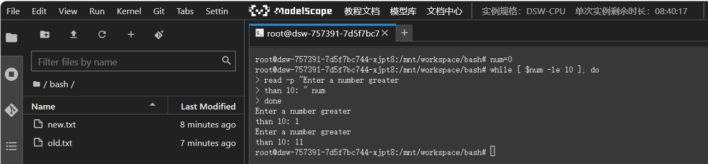
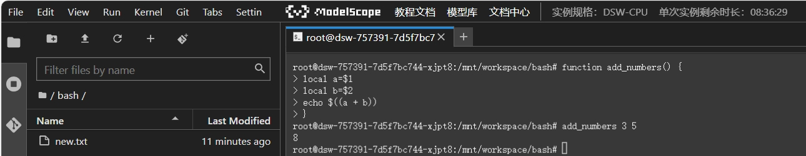

# bash shell
## 前言
Bash（Bourne - Again Shell）是一种 Unix shell 和命令语言。它是许多 Linux 发行版和 macOS 系统中的默认 shell。Shell 是一个用户与操作系统内核之间的接口，用户通过在 shell 中输入命令来让操作系统执行各种任务，如文件操作、进程管理等。本节将介绍在云端部署项目时，bash的常用语法。
## bash shell基础认识
**Shell**
- Shell是位于用户和操作系统内核之间的中间程序。它充当用户和内核之间的代理，其主要功能是接收用户操作，像图形界面中的点击图标操作或者在命令行输入的命令。
- 这些操作在Shell中经过简单处理后再传递给内核。因为内核直接操作计算机硬件，出于安全、复杂程度以及操作繁琐等因素考虑，用户不能直接接触内核，所以需要Shell这个中介。
- Shell还是一种脚本语言，用户编写的源码可以直接运行，无需编译，这使得它在使用上较为便捷，能够快速地实现各种操作控制计算机。

**Bash**
- Bash是由GNU组织开发的一种Shell。它和sh有密切的关系，sh是UNIX上第一个流行的标准Shell，bash对sh保持了兼容性。
- 在各种Linux发行版中，bash是默认配置的Shell，这是因为它在功能上对sh进行了扩展和补充。虽然在大多数情况下bash可以代替sh，并且两者的区别不大，但在某些特殊场景下，还是会存在不兼容的情况。如今sh基本被bash所代替，bash在现代操作系统环境下发挥着重要的Shell功能。

简单来说，Shell 是一种编程语言，它提供了一系列的命令、语法结构和操作符，用于编写脚本以实现自动化任务和系统管理等功能。而Bash（Bourne - Again Shell）是众多 Shell 中的一种，它继承了 Shell 的基本特性，并且在其基础上有了更多的扩展和功能，所以它也是一种编程语言。

## bash的语法
### 变量的定义与使用
- **定义变量**：变量与变量内容以一个等号 “=” 来连结，等号两边不能直接接空白字符，变量名只能是英文字母与数字且开头字符不能是数字。例如：`name="John"`。
- **引用变量**：在需要使用变量的地方，要在变量名前加上`$`符号。比如，`echo $APP_NAME`，这会输出变量`APP_NAME`的值。如果要在字符串中使用变量，为了变量名和其他字符有明确的区分，需要使用花括号，如`echo "The application ${APP_NAME} is running."`。
- **变量运算**：可以使用 “expr” 命令或双括号 “((...))” 进行算术运算。如a=5;b=3;result=$(expr $a + $b)或((result=a + b))。



从图中可以看出，获取变量的值时需要加上符号"$"；双括号和expr关键字都有对变量进行运算的含义，但是使用expr时，进行运算的两个变量必须与运算符号之间有一个空格。

- **特殊变量定义**
    - **反单引号或$()**：在一串指令的执行中，若需要借助其他指令提供的信息，可使用“$(指令)”。例如`ls -l $(find /usr/bin /usr/sbin -perm /6000)`。
    - **双引号与单引号**：变量内容若有空白字符可使用双引号“"”或单引号“'”将变量内容结合起来，双引号内的特殊字符如“$”等保有原本特性，单引号内特殊字符则仅为一般字符。例如`hero="I am $name"`（$name会被替换为变量值），`hero='I am $name'`（$name不会被替换）。
    - **跳脱字符“\”**：可用其将特殊符号（如[Enter]、$、\、空白字符、'等）变成一般字符。
    - **变量累加**：若变量为扩增变量内容时，可用“$变量名”或“${变量}”累加内容，如`name=${name}new`。
    - **环境变量**：若变量需要在其他子程序执行，则需要用“export”使变量变成环境变量，如`export PATH=$PATH:/new/dir`。
    - **取消变量**：使用“unset”取消变量，如`unset name`。




### 输入输出
- **echo**：用于输出文本或变量的值，如`echo "Hello, World!"`，还可使用“-n”选项禁止输出末尾换行符，如`echo -n "No newline"`。
- **printf**：提供更格式化的输出方式，如`printf "My name is %s and I am %d years old.\n" $name $age`，其中“%s”用于输出字符串，“%d”用于输出整数，“\n”表示换行。
- **read**：从用户输入读取数据并存储到变量中，如`read -p "Please enter your name: " user_name`，“-p”选项用于显示提示信息。



### 条件判断
- **if - then - else语句**：基本格式为`if [ 条件表达式 ]; then 执行语句; else 执行语句; fi`。条件表达式可使用多种比较运算符，如“-eq”（等于）、“-ne”（不等于）、“-lt”（小于）、“-le”（小于等于）、“-gt”（大于）、“-ge”（大于等于），也可使用“-d”判断是否为目录、“-f”判断是否为文件等。例如判断一个数是否大于10：
```bash
num=15
if [ $num -gt 10 ]; then
    echo "$num is greater than 10"
else
    echo "$num is less than or equal to 10"
fi
```



- **case语句**：用于多分支条件判断，例如根据用户输入选项执行不同操作：
```bash
echo "Choose a color (red/green/blue):"
read color
case $color in
    "red")
        echo "You chose red.";;
    "green")
        echo "You chose green.";;
    "blue")
        echo "You chose blue.";;
    *)
        echo "Invalid color.";;
esac
```


### 循环语句
- **for循环**
    - **格式一**：`for 变量 in 值列表; do 执行语句; done`，用于遍历列表。如遍历文件列表并打印文件名：
```bash
for file in *.txt; do
    echo $file
done
```
    - **格式二**：`for ((初始值; 条件; 步长)); do 执行语句; done`，用于执行固定次数循环或基于算术运算的循环。如计算1到10的和：
```bash
sum=0
for ((i = 1; i <= 10; i++)); do
    ((sum += i))
done
echo "The sum is $sum"
```


- **while循环**：格式为`while [ 条件表达式 ]; do 执行语句; done`，在满足条件时持续执行操作。如不断要求用户输入数字直到大于10：
```bash
num=0
while [ $num -le 10 ]; do
    read -p "Enter a number greater than 10: " num
done
echo "You entered a number greater than 10."
```


### 函数定义与调用
- **定义函数**：函数定义格式为`function 函数名() { 执行语句; }`或者`函数名() { 执行语句; }`。例如定义一个计算两个数和的函数：
```bash
function add_numbers() {
    local a=$1
    local b=$2
    echo $((a + b))
}
```
- **调用函数**：调用上述函数可使用`add_numbers 3 5`，其中3和5是传递给函数的参数。



### 系统相关操作
- **查看与切换Shell**
    - 系统所有合法的Shell都在“/etc/shells”文件内，可查看该文件内容了解。
    - 用户默认使用的Shell在“/etc/passwd”文件中，使用冒号“:”分隔的第7个字段记录了该账号默认的Shell。用户可通过直接输入Shell的执行文件（如“/bin/csh”）来切换Shell，确认当前Shell可使用“echo $0”。
- **管理进程**：使用“kill”命令管理进程，默认发送15号信号正常关闭程序，使用“kill -9 PID号码”可强制关闭程序（PID可通过“jobs -l”等命令获取）。例如：
```bash
# 将vim程序放进背景中暂停
vim checking.txt
jobs -l
# 尝试删除该工作（可能无法生效）
kill PID号码
# 强制删除该工作
kill -9 PID号码
```
- **系统救援**
    - **systemd方式救援**：当出现如文件系统或“/etc/fstab”设定档错误、root的Shell被误改等问题时，可在开机进入选单后5秒内按下方向键选择第一个开机选单项目，按下“e”编辑核心参数，在“linux”那一行最后添加“rd.break”，然后按下“Ctrl + x”进入救援模式。救援模式下，将根目录挂载到“/sysroot”目录（默认只读，需用“mount -o remount,rw /sysroot”重新挂载为可读写），再用“chroot /sysroot”切换根目录，之后可进行修复操作（如修改“/etc/fstab”、更改root的Shell等），完成后执行“mount -a”，并创建“/.autorelabel”文件（处理SELinux相关问题），最后“exit”并“reboot”重启系统。
    - **bash直接救援（可选，非必要不使用）**：开机过程中选择第一个开机选单，按下“e”进入互动编辑模式，在“linux”那一行最后添加“init=/bin/bash”并按下“Ctrl + x”启动。出现“bash - 5.1#”后，使用绝对路径进行操作，如“mount -o remount,rw /”、“mount -a”、“/usr/sbin/usermod -s /bin/bash root”等，修改完成后使用“/usr/sbin/reboot -f”强制重启（因为非正规使用systemd，不能直接用“reboot”）。

### 环境变量影响操作行为
- **PATH**：执行档搜索的路径，目录与目录中间以冒号“:”分隔，顺序重要。设定错误可能导致系统问题，如无法正常使用命令。可通过修改PATH变量来添加或调整命令搜索路径，如`PATH=$PATH:/new/dir`（将“/new/dir”添加到PATH路径中）。
- **LANG和LC_ALL**：语系资料，影响如“date”输出信息的语言格式等。
- **HOME**：代表使用者的家目录，“~”代表此目录。
- **MAIL**：“mail”指令收信时系统读取的邮件信箱文件。
- **HISTSIZE**：设定“历史命令”记录的笔数。
- **RANDOM**：“随机乱数”变量，在BASH环境下其值介于0 - 32767之间，可通过“echo $RANDOM”获取随机数。
- **PS1**：命令提示字符，可通过修改其值来改变命令提示格式，如`PS1='[\u@\h \t \W]\$ '`（设置包含用户名、主机名、时间、当前工作目录的提示格式），可通过“man bash”搜索“PS1”关键字了解更多设定方式。
- **$?**：该变量内容为指令的返回值，0代表指令正常运作结束，非0代表指令有错误。可在脚本中根据“$?”的值来判断前一个命令是否执行成功，从而决定后续操作。例如：
```bash
ls /some/file
if [ $? -eq 0 ]; then
    echo "The file exists."
else
    echo "The file does not exist."
fi
```

