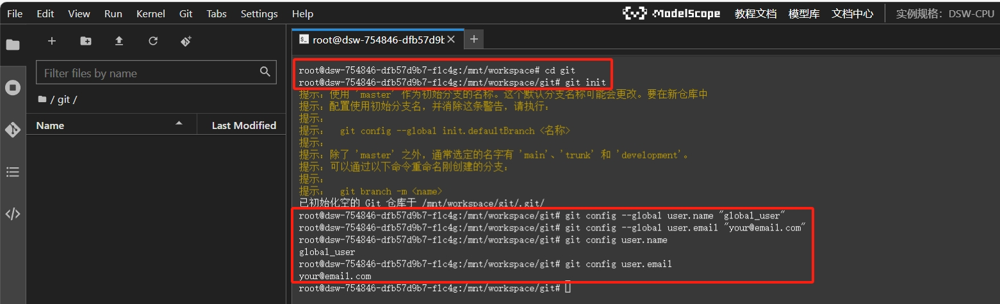
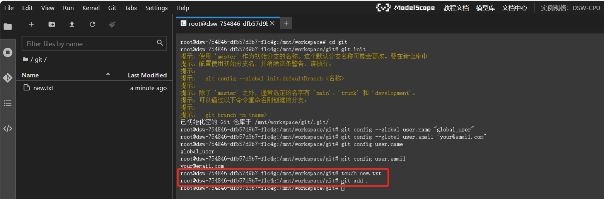
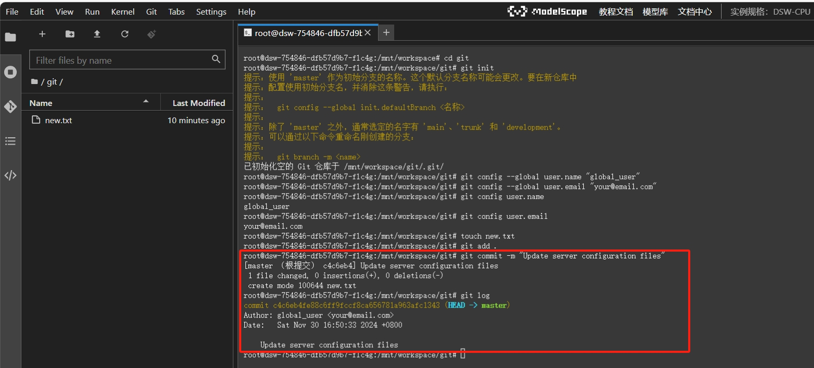
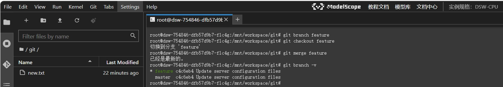

# lesson5.Git

## 前言

本节将介绍Git的使用，并给出了用法示例。其中，对github进行远程操控的部分请大家注册github账号自行尝试我们给出的命令行指令。

## 什么是Git

Git 是一个开源的分布式版本控制系统。它用于高效地处理从非常小到非常大的项目版本管理，最初由 Linus Torvalds 开发，用于管理 Linux 内核开发。

Git 本身是一个命令行工具，通过一系列命令来完成版本控制的操作。例如，在本地开发环境中，开发人员可以在终端（如 Linux 的 Bash、Windows 的 PowerShell 或 Git Bash 等）中使用git init命令初始化一个本地仓库。之后，可以使用git add将文件添加到暂存区，用git commit -m "提交信息"来提交更改到本地仓库。像git status用于查看仓库状态，git log用于查看提交历史等操作，这些都是在命令行中频繁使用的基本操作。

例如，当你独自开发一个小型的 Web 应用项目，在本地计算机上创建了一个项目文件夹。通过命令行进入该文件夹后，使用git init初始化仓库。在你编写代码的过程中，当你完成一个小功能或者修改了一些代码，你可以使用git add和git commit来记录这些更改，这样就可以在本地构建起一个完整的版本控制系统，方便你管理自己的代码版本，而这个过程完全不需要依赖 GitHub 或其他远程代码托管平台。

## Git的使用

### 仓库初始化与配置
**1、初始化仓库**

- `git init`：在云端服务器的指定目录下创建一个新的 Git 仓库。例如，当你需要在服务器的/var/www/my_project目录下开启一个新的项目仓库时，在该目录下执行git init，就会生成一个隐藏的.git文件夹来存储仓库的版本控制信息。

    - 当你使用git init命令初始化一个仓库后，会在当前目录下创建一个隐藏的.git文件夹。在大多数操作系统中，默认情况下隐藏文件是不可见的。


**2、配置用户信息**

- `git config --global user.name "Your Name"`：设置全局的用户名。在云端服务器上进行操作时，正确配置用户名可以明确提交的作者身份。

- `git config --global user.email "your@email.com"`：设置全局的电子邮件地址，用于更详细地记录提交的归属。

- 查看用户信息：
    - 使用git config user.name命令来查看当前配置的用户名；
    - 使用git config user.email命令来查看配置的电子邮件地址。



### 文件管理与提交操作
**1、添加文件到暂存区**
- 暂存区
    - 在 Git 中，暂存区（Staging Area）是一个介于工作目录（Working Directory）和本地仓库（Local Repository）之间的中间区域。可以把它想象成一个 “准备区域”，用于挑选和整理要提交到本地仓库的文件更改。
    - 工作目录是你在计算机（包括云端服务器）上实际看到和操作的文件目录，其中的文件可能处于各种状态，比如刚被创建、被修改或者被删除。而本地仓库则是 Git 用来存储项目完整版本历史的地方，每次提交都会在本地仓库中记录一个新的版本。暂存区就是在这两者之间起到一个缓冲和筛选的作用。

- `git add`：
    - `git add .`：将当前目录下所有文件（包括子目录中的文件）添加到暂存区。这在服务器上添加新的文件或者更新已有文件后准备提交时非常有用。例如，在服务器上完成了某目录下一些文件的更新，使用`git add .`可以将这些更新后的文件全部添加到暂存区。
    - `git add -p`（交互式添加）：逐个确认每个文件块的修改是否添加到暂存区。这种方式可以更精细地控制添加的内容，尤其适用于对一个文件有多处修改，只想添加部分修改的情况。



如上图所示，`touch new.txt`在当前文件夹下新建文件new.txt，再使用`git add .`将当前文件夹下新增添或者修改的文件更新到git仓库中。

**2、提交更改到本地仓库**

- `git commit -m "提交说明"`：将暂存区中的文件提交到本地仓库。提交说明应该清晰地描述本次提交所做的更改。例如，
```
git commit -m "Update server configuration files"
```
用于记录对服务器配置文件的更新。其中，-m选项后面的引号中的内容是提交说明（commit message）。这个说明应该简洁而准确地描述本次提交所做的更改。

- 提交完成后，可以使用`git log`命令来查看提交历史。



### 分支操作

**1、创建分支**

- `git branch <分支名称>`：在云端服务器的仓库中创建一个新的分支。例如，
```
git branch feature
```
可以创建一个一个名为feature的新分支。

**2、切换分支**
- `git checkout <分支名称>`：切换到指定的分支。比如，从主分支切换到刚才创建的服务器优化分支可以使用
```
git checkout feature
```

**3、合并分支**
- `git merge <分支名称>`：将指定分支合并到当前分支。
```
git merge feature
```
将feature分支合并到主分支。

**4、查看分支信息**
    - `git branch -v`：查看本地分支的最后一次提交信息，包括分支名称、提交哈希值和提交说明。这有助于在云端服务器上快速了解各个分支的状态



### 远程仓库交互

**1、添加远程仓库**
- `git remote add <远程仓库名称> <远程仓库URL>`：将云端服务器上的本地仓库与远程仓库（如 GitHub、GitLab 等）关联起来。例如，
```
git remote add easy-dsp https://github.com/datawhalechina/easy-dsp
```
这里的`easy-dsp`是远程仓库名称，后面是远程仓库的 URL。

**2、推送本地更改到远程仓库**
- `git push <远程仓库名称> <本地分支名称>`：将云端服务器上本地分支的内容推送到远程仓库对应的分支。例如，
```
git push feature master
```
会将服务器本地主分支master的内容推送到远程仓库feature的master分支。

**3、从远程仓库拉取更改**
- `git pull <远程仓库名称> <本地分支名称>`：从远程仓库获取最新的更改并合并到云端服务器上的本地分支。例如，git pull origin master会从远程仓库origin的master分支拉取最新内容并合并到服务器本地主分支。

### 查看状态与历史记录
**1、查看仓库状态**
- `git status`：查看云端服务器上工作目录和暂存区的状态。它会显示哪些文件被修改了但还没添加到暂存区，哪些文件已经在暂存区等待提交等信息，帮助你了解仓库的当前情况。

**2、查看提交历史**
- `git log`：显示云端服务器上仓库的提交历史记录，包括提交的哈希值、作者、日期和提交说明等内容。通过git log可以追溯服务器上项目的开发过程。

### 文件差异比较
**1、查看文件差异**
- `git diff`：比较云端服务器工作目录中的文件和暂存区中的文件差异。如果想查看暂存区和最近一次提交之间的文件差异，可以使用git diff --staged（在旧版本的 Git 中是git diff --cached）。这有助于在服务器上查看文件在不同阶段的变化情况。

**2、比较不同分支之间的差异**
- `git diff <分支1> <分支2>`：比较两个分支之间的差异。例如，git diff master feature - server - optimization可以查看主分支master和服务器优化分支之间的差异，方便了解在不同分支上的更改内容。