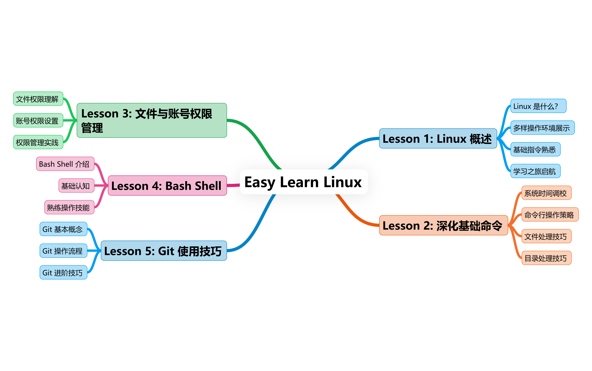

# Easy Learn Linux 

# 项目简介
本项目专注于引领 `0` 基础小白快速掌握Linux指令，方便在服务器上的部署。

- Lesson1 以深入浅出的方式阐释 Linux 究竟为何物，全面展示其多样操作环境，并引导学员熟悉基础指令，开启 Linux 学习之旅。

- Lesson2 则聚焦于深化基础命令运用，涵盖系统时间的精准调校、命令行操作的高效辅助策略以及文件与目录的灵活处理技巧。

- Lesson3 学习文件权限与账号权限的管理。

- Lesson4 从基础认知逐步过渡到熟练驾驭 bash shell。

- Lesson5 演示 Git 的使用技巧。

通过本项目系统且全面的教学，助力有服务器操作部署需求的零基础学习者熟练掌握 Linux 指令，开启高效服务器指令调用的新征程，为其在服务器相关领域的深入探索与实践奠定坚实基础。 

# 项目目录

## Lesson1.Linux的简介、操作环境使用与基础指令
- 什么是Linux
- Linux环境介绍
- 简单的命令介绍

## Lesson2.Linux 基础命令与文档管理
- 系统时间操作
- 命令行操作辅助技巧
- 文件与目录操作

## Lesson3.文件权限与账号权限了解
- 文件权限管理
- 基础帐号管理
- 帐号与权限用途

## Lesson4.bash
- bash shell基础认识
- bash shell的使用

## Lesson5.Git
- 什么是Git
- Git使用

# 贡献者名单
| 姓名 | 职责 | 简介 | 所属单位 |
| ---- | ---- | ---- | ---- |
| 晏萌 | 项目负责人 | 教程3~5章贡献者 | 福州大学 |
| 蔡鋆捷 | 协作者 | 教程1~2章贡献者 | 福州大学 |

# 联系方式
项目负责人联系方式：790080078@qq.com

写作者联系方式：3459391063@qq.com

# 关注我们
扫描下方二维码关注公众号：Datawhale
  

# LICENSE
知识共享许可协议
本作品采用http://creativecommons.org/licenses/by-nc-sa/4.0/协议进行许可。
